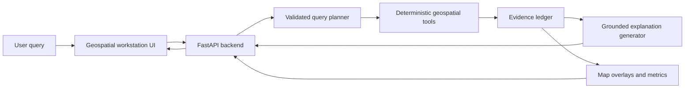
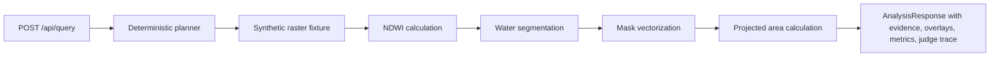

# GeoNexus SatQuery AI Architecture

## Target Architecture

## Milestone 1 Architecture

## Planned Tool Contract

- `inspect_raster_metadata`
- `validate_crs`
- `calculate_ndvi`
- `calculate_ndwi`
- `calculate_ndbi`
- `segment_water`
- `classify_land_cover`
- `detect_temporal_change`
- `vectorize_mask`
- `calculate_polygon_area`
- `locate_features`
- `compare_regions`
- `create_map_overlay`
- `generate_grounded_explanation`
- `export_analysis_report`

Milestone 1 implements the core path for water segmentation and area calculation. Temporal change, real raster ingestion, and multimodal fusion remain planned.
